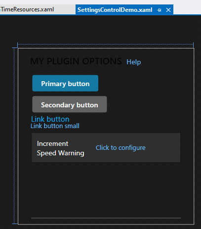
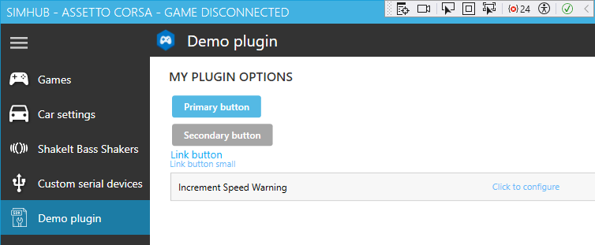

# User.PluginSdkDemo
 Portable plugin SDK demo from [SimHub 9.1.12](https://www.simhubdash.com/download-2/)
 **after** `User.PluginSdkDemo.csproj` *portability changes*  
## XAML user interface:&nbsp; [Create a UI by using XAML Designer](https://learn.microsoft.com/en-us/visualstudio/xaml-tools/creating-a-ui-by-using-xaml-designer-in-visual-studio?view=vs-2022)  
Until now, [my **SimHub plugins**](https://blekenbleu.github.io/static/SimHub/) avoided having any user interface:  
- @Romainrob *20 Jan 2023* "remove `IWPFSettingsV2` from the class declaration"  

### SimHub user interface uses [XAML](https://learn.microsoft.com/en-us/visualstudio/xaml-tools/?view=vs-2022)  
- @MorGuux *18 Jul 2018*:&nbsp; It uses WPF for the visual framework, so you can use anything WPF, not forms  
- when Visual Studio is first launched for this project, the **SettingsControlDemo.xaml** tab will show:  
	  
	... which displays in SimHub as:  
	  
- @Wotever *12 Aug 2018*:&nbsp; "Designer really miss of precision, it's way better to use the xaml editor.  
	 	- 	With designer you barely can't do scalable ui"  
- [MahApps.Metro documentation](https://mahapps.com/)  
- @RaceX *20 Nov 2022*:&nbsp; you can use the xaml hot reload feature while debugging    
- [PropertyChanged code](https://github.com/Fody/PropertyChanged) for "live" XAML  
- [path to running `SimHubWPF.exe`](https://learn.microsoft.com/en-us/dotnet/api/system.environment.processpath?view=net-8.0):&nbsp; `System.Environment.ProcessPath`  
- [elapsed time from plugin end to restart](https://stackoverflow.com/questions/2821040/how-do-i-get-the-time-difference-between-two-datetime-objects-using-c)  
- continue using a mouse if the same device number and hardware ID?  
